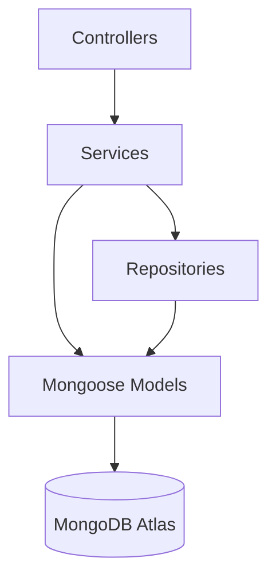
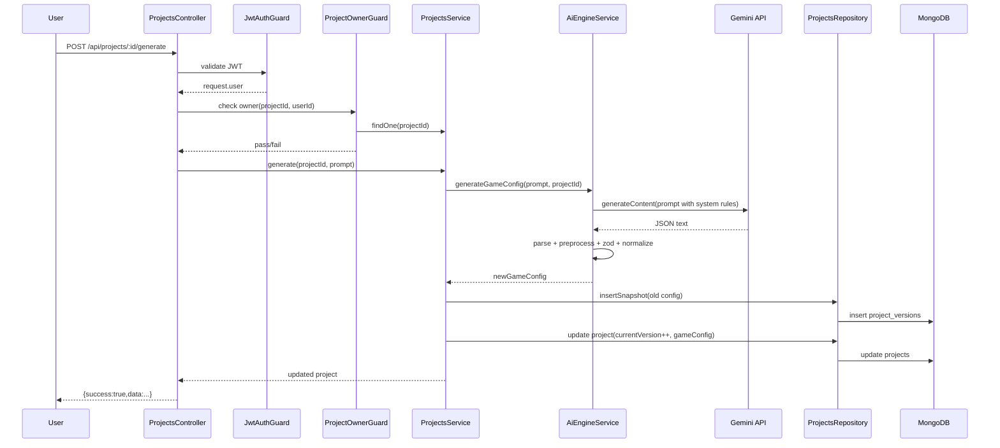
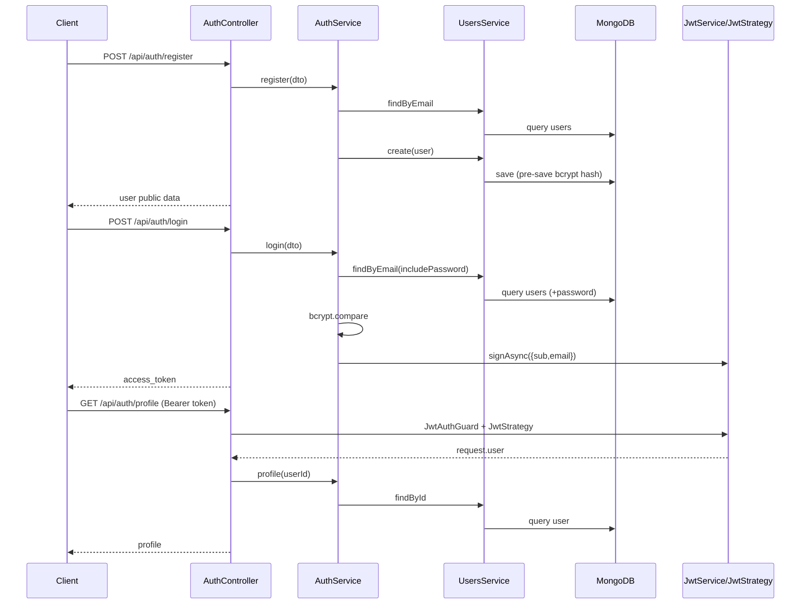
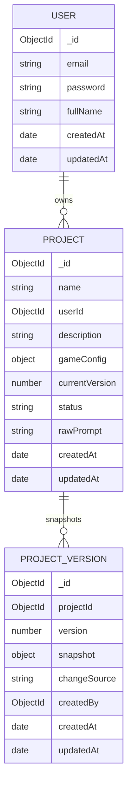

# SYSTEM ARCHITECTURE — AI No-code Game Studio (Backend)

## 0) Scope & Snapshot

Tài liệu này mô tả kiến trúc hiện tại của `source-code/backend` dựa trên code thực tế và tài liệu trong `docs/`.

- Framework: NestJS + TypeScript
- Database: MongoDB Atlas + Mongoose
- Auth: JWT Access Token + Passport
- AI: Gemini (`@google/generative-ai`) + Zod validation
- API Prefix: `/api`
- Global response envelope: `{ success: true, data: ... }`

---

## 1) Layered Architecture (Kiến trúc phân tầng)

### 1.1 Phân tầng tổng thể

Hệ thống đang theo mô hình module-based + layered:

1. **Controller Layer**
   - Nhận HTTP request, bind DTO, áp Guard, gọi service.
2. **Service Layer**
   - Chứa nghiệp vụ cốt lõi (auth, AI generation, project versioning/rollback, ...).
3. **Repository/Model Layer**
   - Repository (hiện có rõ nhất ở Project) thao tác Mongoose model.
   - Với module đơn giản, service gọi model trực tiếp.
4. **Persistence Layer**
   - Mongo collections: `users`, `projects`, `project_versions`, `assets`, `prompts`.

### 1.2 Module hiện có

| Module | Vai trò | Thành phần chính |
|---|---|---|
| `AuthModule` | Đăng ký/đăng nhập/profile + JWT strategy | `AuthController`, `AuthService`, `JwtStrategy`, `JwtAuthGuard` |
| `UsersModule` | Quản lý user model/service nền cho auth | `UserSchema`, `UsersService`, `UsersController` |
| `ProjectsModule` | Nghiệp vụ project + generate + rollback + versioning | `ProjectsController`, `ProjectsService`, `ProjectsRepository`, `ProjectOwnerGuard` |
| `ProjectVersionsModule` | API tạo snapshot trực tiếp | `ProjectVersionsController`, `ProjectVersionsService` |
| `AssetsModule` | Lưu metadata asset | `AssetsController`, `AssetsService` |
| `PromptsModule` | Log prompt/response AI | `PromptsController`, `PromptsService` |
| `AiEngineModule` | Gọi Gemini, parse/normalize/validate game config | `AiEngineController`, `AiEngineService` |
| `DatabaseModule` | Kết nối DB + logging + global mongoose JSON transform | `MongooseModule.forRootAsync`, `DatabaseLoggerService` |

### 1.3 Sơ đồ phân tầng (Mermaid)

---

## 2) API & Endpoint Map

> Lưu ý: tất cả route bên dưới đều có tiền tố `/api` từ `main.ts`.

### 2.1 Route hạ tầng

| Method | Path | Guard | Handler |
|---|---|---|---|
| GET | `/` | None | `AppController.getHello()` |
| N/A | `/docs` | None | Swagger UI (setup trong `main.ts`) |

### 2.2 Auth APIs

| Method | Path | Guard | Controller Handler |
|---|---|---|---|
| POST | `/auth/register` | None | `AuthController.register()` |
| POST | `/auth/login` | None | `AuthController.login()` |
| GET | `/auth/profile` | `JwtAuthGuard` | `AuthController.profile()` |

### 2.3 Users APIs

| Method | Path | Guard | Controller Handler |
|---|---|---|---|
| POST | `/users` | None | `UsersController.create()` |

### 2.4 Projects APIs

| Method | Path | Guard | Controller Handler |
|---|---|---|---|
| POST | `/projects` | None | `ProjectsController.create()` |
| GET | `/projects/:id` | `JwtAuthGuard`, `ProjectOwnerGuard` | `ProjectsController.findOne()` |
| GET | `/projects/:id/versions` | `JwtAuthGuard`, `ProjectOwnerGuard` | `ProjectsController.listVersions()` |
| PATCH | `/projects/:id` | `JwtAuthGuard`, `ProjectOwnerGuard` | `ProjectsController.update()` |
| POST | `/projects/:id/generate` | `JwtAuthGuard`, `ProjectOwnerGuard` | `ProjectsController.generate()` |
| POST | `/projects/:id/rollback` | `JwtAuthGuard`, `ProjectOwnerGuard` | `ProjectsController.rollback()` |

### 2.5 AI Engine APIs

| Method | Path | Guard | Controller Handler |
|---|---|---|---|
| GET | `/ai/models` | None | `AiEngineController.listModels()` |
| POST | `/ai/generate` | None | `AiEngineController.generate()` |

### 2.6 Other Module APIs

| Method | Path | Guard | Controller Handler |
|---|---|---|---|
| POST | `/project-versions` | None | `ProjectVersionsController.create()` |
| POST | `/assets` | None | `AssetsController.create()` |
| POST | `/prompts` | None | `PromptsController.create()` |

---

## 3) Data Flow (Luồng dữ liệu)

## 3.1 AI Generation Flow (Project-driven)

Luồng chuẩn khi gọi `POST /api/projects/:id/generate`:

1. **HTTP Request** vào `ProjectsController.generate()`.
2. **Auth & Ownership Guard**:
   - `JwtAuthGuard` xác thực token.
   - `ProjectOwnerGuard` load project và kiểm tra `project.userId === request.user.userId`.
3. `ProjectsService.generate(id, dto)`:
   - Load project.
   - Gọi `AiEngineService.generateGameConfig(prompt, projectId)`.
4. `AiEngineService.generateGameConfig(...)`:
   - Build prompt context (`rawPrompt` cũ nếu có).
   - Inject palette/shapes rules vào prompt.
   - Gọi Gemini `model.generateContent`.
   - Parse JSON text, xử lý logic defensively (object -> array, string[] -> object[]).
   - Validate bằng `GameConfigSchema` (Zod).
   - Normalize positions, HEX colors, log `source_color`.
5. Quay lại `ProjectsService.generate`:
   - Bắt đầu Mongo transaction.
   - Insert snapshot cũ vào `project_versions` (`changeSource: 'ai'`).
   - Update `projects` với `gameConfig` mới + `currentVersion + 1` + `rawPrompt` mới.
   - Commit transaction.
6. Response đi qua `TransformInterceptor` => `{ success: true, data: ... }`.

### 3.2 Mermaid — AI Flow

## 3.3 Authentication Flow

### Register (`POST /api/auth/register`)

1. Validate `RegisterDto` (`email`, `password`, `fullName`).
2. `AuthService.register` kiểm tra email tồn tại (`UsersService.findByEmail`).
3. Tạo user (`UsersService.create`) -> `UserSchema.pre('save')` hash password bằng bcrypt.
4. Trả user public data.

### Login (`POST /api/auth/login`)

1. Validate `LoginDto`.
2. `UsersService.findByEmail(email, true)` để include `password` (`select('+password')`).
3. `bcrypt.compare` kiểm chứng mật khẩu.
4. `JwtService.signAsync({ sub, email })` phát hành access token.

### Profile (`GET /api/auth/profile`)

1. `JwtAuthGuard` -> `JwtStrategy` extract Bearer token.
2. `JwtStrategy.validate(payload)` map thành `request.user = { userId, email }`.
3. `AuthService.profile(userId)` load user và trả profile.

### Mermaid — Auth Flow

---

## 4) Logic Internal (Hàm cốt lõi)

### 4.1 Auth / Users

| Hàm | Vị trí | Nhiệm vụ |
|---|---|---|
| `UserSchema.pre('save')` | `users/schemas/user.schema.ts` | Hash password nếu thay đổi (`bcrypt.hash(10)`). |
| `UsersService.findByEmail(email, includePassword)` | `users/users.service.ts` | Query user theo email, tùy chọn include password. |
| `AuthService.register(dto)` | `auth/auth.service.ts` | Check duplicate email, create user, trả public profile. |
| `AuthService.login(dto)` | `auth/auth.service.ts` | Verify password bằng bcrypt, sign JWT access token. |
| `JwtStrategy.validate(payload)` | `auth/strategies/jwt.strategy.ts` | Chuẩn hóa payload JWT thành request user context. |

### 4.2 Project / Versioning

| Hàm | Vị trí | Nhiệm vụ |
|---|---|---|
| `ProjectsService.update(id, dto)` | `projects/projects.service.ts` | Nếu `gameConfig` đổi: transaction snapshot (`manual`) rồi update + tăng `currentVersion`. |
| `ProjectsService.generate(id, dto)` | `projects/projects.service.ts` | Gọi AI Engine, snapshot (`ai`), update project (config mới + `currentVersion++`). |
| `ProjectsService.rollback(id, dto)` | `projects/projects.service.ts` | Tìm snapshot target, lưu snapshot hiện tại (`rollback`), restore config target. |
| `ProjectsRepository.insertSnapshot(...)` | `projects/projects.repository.ts` | Persist `ProjectVersion` document cho history. |
| `ProjectOwnerGuard.canActivate()` | `projects/guards/project-owner.guard.ts` | Chặn user không phải owner truy cập/sửa project. |

### 4.3 AI Engine

| Hàm | Vị trí | Nhiệm vụ |
|---|---|---|
| `AiEngineService.generateGameConfig(prompt, projectId?)` | `ai-engine/ai-engine.service.ts` | Orchestrate toàn bộ pipeline gọi Gemini -> parse -> validate -> normalize -> retry. |
| `extractLikelyJson(text)` | `ai-engine/ai-engine.service.ts` | Trích JSON object từ raw text model trả về. |
| `preprocessLogicArray(parsed, logger)` | `ai-engine/ai-engine.service.ts` | Chuyển `logic` dạng string[] / mixed về object[] phòng vỡ Zod. |
| `normalizeThemeAndEntityHexColors(config)` | `ai-engine/ai-engine.service.ts` | Validate/fallback HEX từ palette pool cho theme/entity. |
| `clampEntityPositions(config)` | `ai-engine/ai-engine.service.ts` | Ép tọa độ entity vào [0..100]. |

### 4.4 Cơ chế Versioning / Snapshot

- `Project.currentVersion` là version hiện tại (latest state).
- Trước khi update state mới (manual/ai/rollback), hệ thống luôn:
  1. Snapshot state cũ vào `ProjectVersion` (gồm `projectId`, `version`, `snapshot`, `changeSource`).
  2. Cập nhật `Project.gameConfig` mới.
  3. Tăng `Project.currentVersion`.
- Điều này tạo chain lịch sử tuyến tính, rollback được và audit được nguồn thay đổi (`ai/manual/rollback`).

---

## 5) Database Schema Relations

### 5.1 Quan hệ chính

- `User (1) -> (n) Project` qua `Project.userId`.
- `Project (1) -> (n) ProjectVersion` qua `ProjectVersion.projectId`.

### 5.2 Mermaid ER Diagram

---

## 6) Integration Rules

## 6.1 Asset Module -> AI Engine injection

`AiEngineService` đang tiêm rules asset vào prompt qua 2 lớp:

1. **`SYSTEM_INSTRUCTION`**
   - Quy tắc màu:
     - ưu tiên màu theo prompt user nếu có,
     - fallback palette nếu không có,
     - bắt buộc `source_color: prompt | palette_fallback`.
   - Quy tắc shape entity: chỉ `Square | Circle | Triangle`.

2. **`buildPaletteAndShapesPromptBlock()`**
   - Inject danh sách palette cụ thể (Lavender, Mint, Peach, Sky) + danh sách shape hợp lệ vào user prompt runtime.

## 6.2 Runtime defensive layer

Ngay cả khi model trả sai format:

- `preprocessLogicArray` sửa `logic` từ string[] -> object[].
- `normalizeThemeAndEntityHexColors` sửa mã HEX sai về màu hợp lệ trong palette pool.
- `GameConfigSchema` (Zod) enforce structure (`source_color`, shapeType enum, player entity, logic object shape).

=> Tầng AI có cả **instruction-level constraint** + **runtime defensive normalization**.

---

## 7) Architectural Notes / Gaps (Thực trạng hiện tại)

1. **Tài liệu vs code đã đổi**
   - Docs ban đầu đề cập user có `username/role`; code auth hiện hành đã tối giản về `email/password/fullName`.
2. **Owner guard cho Create Project**
   - `POST /projects` hiện chưa buộc JWT (client tự gửi `userId`); nếu muốn chặt hơn nên bắt JWT và set `userId` từ token.
3. **ProjectVersionsModule endpoint public**
   - `POST /project-versions` chưa có guard; có thể giới hạn internal-only.
4. **Refresh token chưa có**
   - Auth hiện chỉ Access Token (đúng scope tài liệu hiện tại).

---

## 8) Quick Traceability (File tham chiếu chính)

- Bootstrap: `src/main.ts`
- App wiring: `src/app.module.ts`
- Auth: `src/modules/auth/*`
- Users: `src/modules/users/*`
- Projects/versioning: `src/modules/projects/*`, `src/modules/project-versions/*`
- AI: `src/modules/ai-engine/*`
- DB setup: `src/providers/database/*`
- Design docs: `docs/00-project-init/*`, `docs/01-system-design/*`, `docs/02-backend/*`

