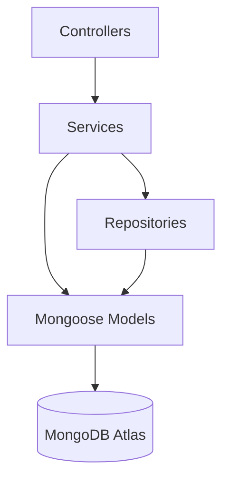
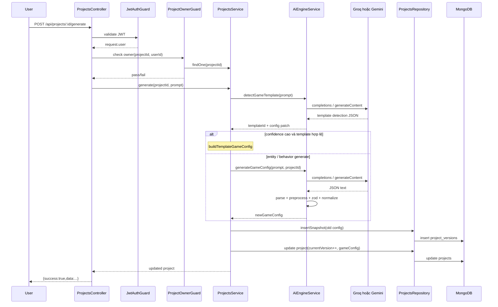
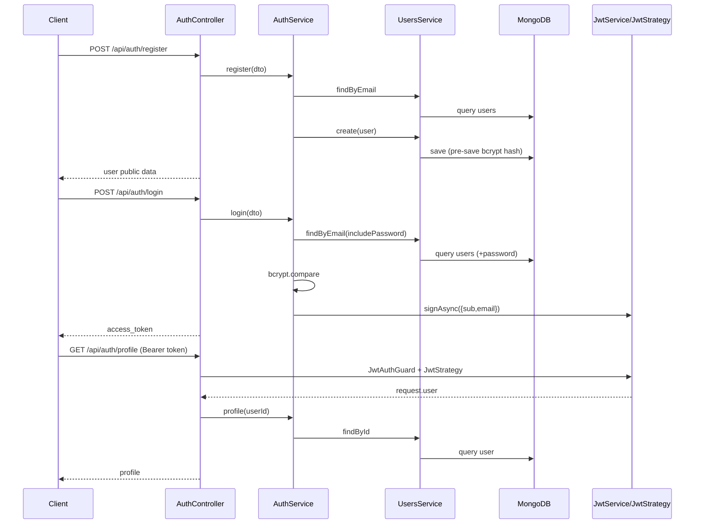
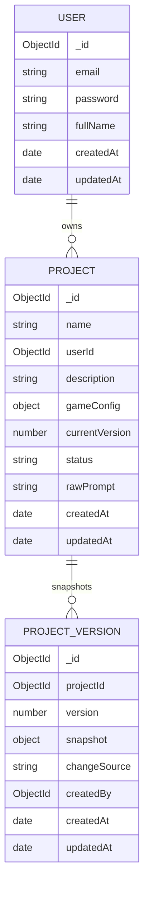

# SYSTEM ARCHITECTURE — AI No-code Game Studio

## 0) Scope & Snapshot

Tài liệu này mô tả kiến trúc **full stack** hiện tại: `source-code/backend`, `source-code/frontend`, và tham chiếu `docs/`.

### Backend

- Framework: NestJS + TypeScript
- Database: MongoDB + Mongoose
- Auth: JWT Access Token + Passport (`JwtAuthGuard`, `JwtStrategy`)
- AI: **Groq** (`groq-sdk`, tùy chọn) hoặc **Gemini** (`@google/generative-ai`) cho `generateGameConfig` và **`detectGameTemplate`**; pipeline Zod (`GameConfigSchema`) + normalize; `POST /projects/:id/generate` có thể trả config **template** hoặc **entity + behaviors**
- API prefix: `/api`
- Global response envelope: `{ success: true, data: ... }` (`TransformInterceptor`)
- Swagger UI: **`/api/docs`** (global prefix + `SwaggerModule.setup('docs', …)`)

### Frontend

- React 19 + Vite + TypeScript
- Routing: `react-router-dom` (`AppRoutes`, `PrivateRoute`)
- Auth: `AuthProvider` + `localStorage` key `access_token`
- Studio state: Zustand `useEditorStore` (`gameConfig`, entities, `addEntity` / `updateEntity` / `removeEntity`)
- UI: Tailwind, Framer Motion, `react-hot-toast`

---

## 1) Layered Architecture (Kiến trúc phân tầng)

### 1.1 Phân tầng tổng thể

Hệ thống đang theo mô hình module-based + layered:

1. **Controller Layer**
   - Nhận HTTP request, bind DTO, áp Guard, gọi service.
2. **Service Layer**
   - Chứa nghiệp vụ cốt lõi (auth, AI generation, project versioning/rollback, ...).
3. **Repository/Model Layer**
   - Repository (hiện có rõ nhất ở Project) thao tác Mongoose model.
   - Với module đơn giản, service gọi model trực tiếp.
4. **Persistence Layer**
   - Mongo collections: `users`, `projects`, `project_versions`, `assets`, `prompts`.

### 1.2 Module hiện có

| Module                  | Vai trò                                               | Thành phần chính                                                                   |
| ----------------------- | ----------------------------------------------------- | ---------------------------------------------------------------------------------- |
| `AuthModule`            | Đăng ký/đăng nhập/profile + JWT strategy              | `AuthController`, `AuthService`, `JwtStrategy`, `JwtAuthGuard`                     |
| `UsersModule`           | Quản lý user model/service nền cho auth               | `UserSchema`, `UsersService`, `UsersController`                                    |
| `ProjectsModule`        | Nghiệp vụ project + generate + rollback + versioning  | `ProjectsController`, `ProjectsService`, `ProjectsRepository`, `ProjectOwnerGuard` |
| `ProjectVersionsModule` | API tạo snapshot trực tiếp                            | `ProjectVersionsController`, `ProjectVersionsService`                              |
| `AssetsModule`          | Lưu metadata asset                                    | `AssetsController`, `AssetsService`                                                |
| `PromptsModule`         | Log prompt/response AI                                | `PromptsController`, `PromptsService`                                              |
| `AiEngineModule`        | Gọi LLM (Groq nếu có `GROQ_API_KEY`, không thì Gemini), parse/normalize/validate game config | `AiEngineController`, `AiEngineService`                                            |
| `DatabaseModule`        | Kết nối DB + logging + global mongoose JSON transform | `MongooseModule.forRootAsync`, `DatabaseLoggerService`                             |

### 1.3 Sơ đồ phân tầng (Mermaid)

---

## 2) API & Endpoint Map

> Lưu ý: tất cả route bên dưới đều có tiền tố `/api` từ `main.ts`.

### 2.1 Route hạ tầng

| Method | Path    | Guard | Handler                            |
| ------ | ------- | ----- | ---------------------------------- |
| GET    | `/`     | None  | `AppController.getHello()`         |
| N/A    | `/api/docs` | None  | Swagger UI (`setup('docs')` + prefix `api`) |

### 2.2 Auth APIs

| Method | Path                    | Guard          | Controller Handler                |
| ------ | ----------------------- | -------------- | --------------------------------- |
| POST   | `/auth/register`        | None           | `AuthController.register()`       |
| POST   | `/auth/login`           | None           | `AuthController.login()`          |
| POST   | `/auth/forgot-password` | None           | `AuthController.forgotPassword()` |
| POST   | `/auth/reset-password`  | None           | `AuthController.resetPassword()`  |
| GET    | `/auth/profile`         | `JwtAuthGuard` | `AuthController.profile()`        |

### 2.3 Users APIs

| Method | Path     | Guard | Controller Handler         |
| ------ | -------- | ----- | -------------------------- |
| POST   | `/users` | None  | `UsersController.create()` |

### 2.4 Projects APIs

| Method | Path                     | Guard                               | Controller Handler                  |
| ------ | ------------------------ | ----------------------------------- | ----------------------------------- |
| POST   | `/projects`              | `JwtAuthGuard`                      | `ProjectsController.create()`       |
| GET    | `/projects`              | `JwtAuthGuard`                      | `ProjectsController.list()`         |
| GET    | `/projects/:id`          | `JwtAuthGuard`, `ProjectOwnerGuard` | `ProjectsController.findOne()`      |
| GET    | `/projects/:id/versions` | `JwtAuthGuard`, `ProjectOwnerGuard` | `ProjectsController.listVersions()` |
| PATCH  | `/projects/:id`          | `JwtAuthGuard`, `ProjectOwnerGuard` | `ProjectsController.update()`       |
| POST   | `/projects/:id/generate` | `JwtAuthGuard`, `ProjectOwnerGuard` | `ProjectsController.generate()`     |
| POST   | `/projects/:id/rollback` | `JwtAuthGuard`, `ProjectOwnerGuard` | `ProjectsController.rollback()`     |

### 2.5 AI Engine APIs

| Method | Path           | Guard | Controller Handler                |
| ------ | -------------- | ----- | --------------------------------- |
| GET    | `/ai/models`   | None  | `AiEngineController.listModels()` |
| POST   | `/ai/generate` | None  | `AiEngineController.generate()`   |

### 2.6 Other Module APIs

| Method | Path                | Guard | Controller Handler                   |
| ------ | ------------------- | ----- | ------------------------------------ |
| POST   | `/project-versions` | `JwtAuthGuard` | `ProjectVersionsController.create()` |
| POST   | `/assets`           | `JwtAuthGuard` | `AssetsController.create()`          |
| POST   | `/prompts`          | `JwtAuthGuard` | `PromptsController.create()`         |

---

## 3) Data Flow (Luồng dữ liệu)

## 3.1 AI Generation Flow (Project-driven)

Luồng chuẩn khi gọi `POST /api/projects/:id/generate`:

1. **HTTP Request** vào `ProjectsController.generate()`.
2. **Auth & Ownership Guard**:
   - `JwtAuthGuard` xác thực token.
   - `ProjectOwnerGuard` load project và kiểm tra `project.userId === request.user.userId`.
3. `ProjectsService.generate(id, dto)`:
   - Load project.
   - Gọi `AiEngineService.detectGameTemplate(prompt)` (LLM trích `templateId` + patch config).
   - Nếu **confidence > 0.7** và template ≠ `none` → `buildTemplateGameConfig` (merge `templateDefaults`).
   - Ngược lại → `AiEngineService.generateGameConfig(prompt, projectId)` (full entity-based config, có thể có `behaviors[]`, `rules`, `lives`).
   - Heuristic: nếu prompt chứa marker chỉnh template Studio (ví dụ `Đang dùng template:` hoặc `CHỈ update templateConfig`) và khớp `templateId` project → có thể **tăng nhẹ confidence** để giữ nhánh template.
4. `AiEngineService.generateGameConfig(...)` (khi không rơi vào nhánh template):
   - Build prompt context (`rawPrompt` cũ nếu có).
   - Inject palette/shapes rules vào prompt.
   - **LLM:** nếu env có `GROQ_API_KEY` → `groq-sdk` `chat.completions` (model `GROQ_MODEL`, mặc định `llama-3.3-70b-versatile`, system = `SYSTEM_INSTRUCTION`); ngược lại → Gemini `generateContent` (cùng nội dung user prompt).
   - Parse JSON text, xử lý logic defensively (object -> array, string[] -> object[]).
   - Validate bằng `GameConfigSchema` (Zod).
   - Normalize positions, HEX colors, log `source_color`.
5. Quay lại `ProjectsService.generate`:
   - Bắt đầu Mongo transaction.
   - Insert snapshot cũ vào `project_versions` (`changeSource: 'ai'`).
   - Update `projects` với `gameConfig` mới + `currentVersion + 1` + `rawPrompt` mới.
   - Commit transaction.
6. Response đi qua `TransformInterceptor` => `{ success: true, data: ... }`.

### 3.2 Mermaid — AI Flow

## 3.3 Authentication Flow

### Register (`POST /api/auth/register`)

1. Validate `RegisterDto` (`email`, `password`, `fullName`).
2. `AuthService.register` kiểm tra email tồn tại (`UsersService.findByEmail`).
3. Tạo user (`UsersService.create`) -> `UserSchema.pre('save')` hash password bằng bcrypt.
4. Trả user public data.

### Login (`POST /api/auth/login`)

1. Validate `LoginDto`.
2. `UsersService.findByEmail(email, true)` để include `password` (`select('+password')`).
3. `bcrypt.compare` kiểm chứng mật khẩu.
4. `JwtService.signAsync({ sub, email })` phát hành access token.

### Profile (`GET /api/auth/profile`)

1. `JwtAuthGuard` -> `JwtStrategy` extract Bearer token.
2. `JwtStrategy.validate(payload)` map thành `request.user = { userId, email }`.
3. `AuthService.profile(userId)` load user và trả profile.

### Mermaid — Auth Flow

---

## 4) Logic Internal (Hàm cốt lõi)

### 4.1 Auth / Users

| Hàm                                                | Vị trí                            | Nhiệm vụ                                                                                    |
| -------------------------------------------------- | --------------------------------- | ------------------------------------------------------------------------------------------- |
| `UserSchema.pre('save')`                           | `users/schemas/user.schema.ts`    | Hash password nếu thay đổi (`bcrypt.hash(10)`).                                             |
| `UsersService.findByEmail(email, includePassword)` | `users/users.service.ts`          | Query user theo email, tùy chọn include password.                                           |
| `AuthService.register(dto)`                        | `auth/auth.service.ts`            | Check duplicate email, create user, trả public profile.                                     |
| `AuthService.login(dto)`                           | `auth/auth.service.ts`            | Verify password bằng bcrypt, sign JWT access token.                                         |
| `AuthService.forgotPassword(dto)`                  | `auth/auth.service.ts`            | Tạo token reset (hash SHA-256), lưu hạn dùng; luôn trả cùng message (không lộ email).       |
| `AuthService.resetPassword(dto)`                   | `auth/auth.service.ts`            | So khớp token (timing-safe), kiểm tra hạn, đổi mật khẩu (bcrypt pre-save), xóa token reset. |
| `JwtStrategy.validate(payload)`                    | `auth/strategies/jwt.strategy.ts` | Chuẩn hóa payload JWT thành request user context.                                           |

### 4.2 Project / Versioning

| Hàm                                      | Vị trí                                   | Nhiệm vụ                                                                                  |
| ---------------------------------------- | ---------------------------------------- | ----------------------------------------------------------------------------------------- |
| `ProjectsService.update(id, dto)`        | `projects/projects.service.ts`           | Nếu `gameConfig` đổi: transaction snapshot (`manual`) rồi update + tăng `currentVersion`. |
| `ProjectsService.generate(id, dto)`      | `projects/projects.service.ts`           | Gọi AI Engine, snapshot (`ai`), update project (config mới + `currentVersion++`).         |
| `ProjectsService.rollback(id, dto)`      | `projects/projects.service.ts`           | Tìm snapshot target, lưu snapshot hiện tại (`rollback`), restore config target.           |
| `ProjectsRepository.insertSnapshot(...)` | `projects/projects.repository.ts`        | Persist `ProjectVersion` document cho history.                                            |
| `ProjectOwnerGuard.canActivate()`        | `projects/guards/project-owner.guard.ts` | Chặn user không phải owner truy cập/sửa project.                                          |

### 4.3 AI Engine

| Hàm                                                      | Vị trí                           | Nhiệm vụ                                                                            |
| -------------------------------------------------------- | -------------------------------- | ----------------------------------------------------------------------------------- |
| `AiEngineService.detectGameTemplate(prompt)` | `ai-engine/ai-engine.service.ts` | LLM trả `templateId` + patch + `confidence` cho nhánh template trong `ProjectsService.generate`. |
| `AiEngineService.generateGameConfig(prompt, projectId?)` | `ai-engine/ai-engine.service.ts` | Orchestrate pipeline: Groq hoặc Gemini → text → parse → validate → normalize → retry (2 lần). |
| `AiEngineService.callGroq(fullPrompt)` (private)          | `ai-engine/ai-engine.service.ts` | Gọi Groq Chat Completions; system = `SYSTEM_INSTRUCTION`.                            |
| `extractLikelyJson(text)`                                | `ai-engine/ai-engine.service.ts` | Trích JSON object từ raw text model trả về.                                         |
| `preprocessLogicArray(parsed, logger)`                   | `ai-engine/ai-engine.service.ts` | Chuyển `logic` dạng string[] / mixed về object[] phòng vỡ Zod.                      |
| `normalizeThemeAndEntityHexColors(config)`               | `ai-engine/ai-engine.service.ts` | Validate/fallback HEX từ palette pool cho theme/entity.                             |
| `clampEntityPositions(config)`                           | `ai-engine/ai-engine.service.ts` | Ép tọa độ entity vào [0..100].                                                      |

### 4.4 Cơ chế Versioning / Snapshot

- `Project.currentVersion` là version hiện tại (latest state).
- Trước khi update state mới (manual/ai/rollback), hệ thống luôn:
  1. Snapshot state cũ vào `ProjectVersion` (gồm `projectId`, `version`, `snapshot`, `changeSource`).
  2. Cập nhật `Project.gameConfig` mới.
  3. Tăng `Project.currentVersion`.
- Điều này tạo chain lịch sử tuyến tính, rollback được và audit được nguồn thay đổi (`ai/manual/rollback`).

---

## 5) Database Schema Relations

### 5.1 Quan hệ chính

- `User (1) -> (n) Project` qua `Project.userId`.
- `Project (1) -> (n) ProjectVersion` qua `ProjectVersion.projectId`.

### 5.2 Mermaid ER Diagram

---

## 6) Integration Rules

## 6.1 Asset Module -> AI Engine injection

`AiEngineService` đang tiêm rules asset vào prompt qua 2 lớp:

1. **`SYSTEM_INSTRUCTION`**
   - Quy tắc màu:
     - ưu tiên màu theo prompt user nếu có,
     - fallback palette nếu không có,
     - bắt buộc `source_color: prompt | palette_fallback`.
   - Quy tắc shape entity: chỉ `Square | Circle | Triangle`.

2. **`buildPaletteAndShapesPromptBlock()`**
   - Inject danh sách palette cụ thể (Lavender, Mint, Peach, Sky) + danh sách shape hợp lệ vào user prompt runtime.

## 6.2 Runtime defensive layer

Ngay cả khi model trả sai format:

- `preprocessLogicArray` sửa `logic` từ string[] -> object[].
- `normalizeThemeAndEntityHexColors` sửa mã HEX sai về màu hợp lệ trong palette pool.
- `GameConfigSchema` (Zod) enforce structure (`source_color`, shapeType enum, player entity, logic object shape); entity có thể có **`behaviors[]`**, config có **`rules`**, **`lives`** cho behavior runtime.

=> Tầng AI có cả **instruction-level constraint** + **runtime defensive normalization**.

---

## 7) Frontend — Studio & Data Model (Editor)

### 7.1 Route & layout

- **Studio:** `/studio/:projectId` → `EditorPage.tsx` (bảo vệ `PrivateRoute`).
- Layout 3 cột: **AI Chat** (trái, thu/phóng), **Preview / Play** (giữa — toggle), **Layers | Assets + Inspector** (phải).
- File chính: `EditorPage.tsx`, `GameCanvas.tsx`, **`GameRuntime.tsx`** (Phaser Play), `EditorRightColumn.tsx`, `AiChatPanel.tsx`, `LayersPanel.tsx`, `InspectorPanel.tsx`, `AssetsPanel.tsx`.

### 7.2 `gameConfig` & entity trên client

- Store: `useEditorStore.ts` — `EditorGameConfig` gồm `entities`, `theme`, `logic`, `assets?`.
- **`GameEntity`:** `id`, `type`, `shapeType` (`Square` | `Circle` | `Triangle`), `colorHex`/`color`, `position` (%), `width`/`height` (px), `settings?`, **`assetUrl?`** (khi `type === 'sprite'`).
- **Sprite / ảnh thật:** entity `type: 'sprite'` + `assetUrl` → `GameCanvas` render **``** trong khung tuyệt đối, **`object-fit: contain`**, kéo thả vị trí giống entity hình học.
- **Thư viện mẫu:** tab **Assets** — `studioSampleAssets.ts` (`STUDIO_SAMPLE_ASSETS`, MIME kéo `application/x-studio-asset`). Kéo thả vào Preview → `addEntity` với `settings.studioLabel` (hiển thị trên Layers).

### 7.3 API Studio dùng từ frontend

- `GET/ PATCH /api/projects/:id`, `POST .../generate`, `GET .../versions`, `POST .../rollback` — Bearer JWT + owner guard (khớp `projects.controller.ts`).
- Client: `services/projects.api.ts`, `services/auth.api.ts`.

### 7.4 AI Chat — ngữ cảnh scene

- `AiChatPanel.tsx` đọc `gameConfig` từ `useEditorStore` và gửi lên API một **`contextPrompt`**: luôn gồm **`JSON.stringify(gameConfig)`** đầy đủ + `Yêu cầu: …` + **HƯỚNG DẪN TRẢ VỀ** phụ thuộc trạng thái:
  - Có **`templateId`** và **chưa** có entity nào có `behaviors[]`: ưu tiên chỉnh template (giữ `templateId`, cập nhật config template); đổi mechanic sâu → chuyển behavior system (xóa `templateId`, thêm `behaviors[]`).
  - Ngược lại: **ưu tiên behavior system** — entity có `behaviors[]` phù hợp, không dùng `templateId`; liệt kê behavior/actions hợp lệ trong prompt.
- UI chat vẫn hiển thị **chỉ prompt gốc** của user (không hiển thị full `contextPrompt`).

### 7.5 Chế độ Play (Phaser) — `GameRuntime.tsx`

- Toggle **Preview / Play**: Preview = `GameCanvas`; Play = **`GameRuntime`** (Phaser 3 Arcade).
- **Routing scene:**
  1. `templateId` thuộc tập template runtime → scene template tương ứng (`buildSnakeScene`, …).
  2. Không template và `gameConfigUsesBehaviors(gameConfig)` (ít nhất một entity có `behaviors` không rỗng) → **`BehaviorRuntime.tsx`** — scene key `studioBehavior` (`buildBehaviorScene`): groups, colliders, `rules`, UI score/lives/timer, `executeAction`.
  3. Còn lại → **`StudioRuntimeScene`** (key `studioRuntime`): player động WASD/mũi tên, entity khác chủ yếu static; texture từ shape/assetUrl giống behavior scene.
- Chi tiết behavior: **`docs/03-frontend/studio-editor/behavior-runtime.md`**.
- Static file upload: backend phục vụ **`/uploads/`** (CORS cho `localhost:5173`); frontend resolve `assetUrl` tương đối qua origin `:3001` khi Play (Phaser).

---

## 8) Architectural Notes / Gaps (Thực trạng hiện tại)

1. **Tài liệu vs code đã đổi**
   - Docs cũ có thể đề cập `username/role`; user hiện tại: `email`, `password`, `fullName` (+ trường reset password trên schema).
2. **Create Project**
   - `POST /api/projects` **đã** bảo vệ `JwtAuthGuard`; `userId` lấy từ `@CurrentUser() user.sub`, body **không** gửi `userId` (xem `CreateProjectDto`).
3. **Route nội bộ đã bảo vệ JWT**
   - `POST /project-versions`, `POST /assets`, `POST /prompts` dùng `JwtAuthGuard` (theo controller hiện tại).
4. **Refresh token chưa có**
   - Auth hiện chỉ Access Token.
5. **AI Zod vs sprite thủ công**
   - `EntitySchema` dùng `.passthrough()` nên field như `assetUrl` không bị Zod loại khi AI trả về; `GameConfig` vẫn bắt buộc có entity `type: 'player'`. Sprite kéo từ Studio có thể cùng scene với player do AI tạo.

---

## 9) Quick Traceability (File tham chiếu chính)

### Backend

- Bootstrap: `source-code/backend/src/main.ts`
- App wiring: `source-code/backend/src/app.module.ts`
- Auth: `source-code/backend/src/modules/auth/*`
- Users: `source-code/backend/src/modules/users/*`
- Projects/versioning: `source-code/backend/src/modules/projects/*`, `project-versions/*`
- AI: `source-code/backend/src/modules/ai-engine/*`
- DB setup: `source-code/backend/src/providers/database/*`

### Frontend

- Entry / routes: `source-code/frontend/src/App.tsx`, `routes/AppRoutes.tsx`, `routes/PrivateRoute.tsx`
- Auth UI: `pages/auth/*`, `contexts/AuthProvider.tsx`
- Dashboard: `pages/dashboard/*`
- Studio: `pages/studio/*` (gồm `components/GameRuntime.tsx`, `components/BehaviorRuntime.tsx`, `AiChatPanel.tsx`), `store/useEditorStore.ts`, `pages/studio/lib/entityView.ts`, `pages/studio/lib/studioSampleAssets.ts`

### Design docs

- `docs/00-project-init/*`, `docs/01-system-design/*`, `docs/02-backend/*`, `docs/03-frontend/*`
